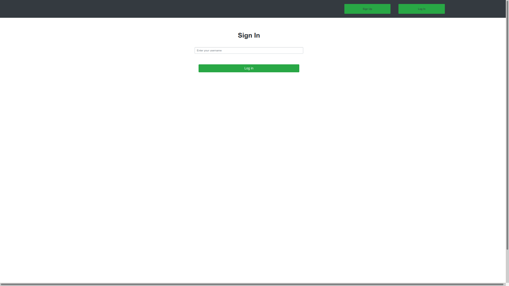

# Transactions App

> This is the capstone project of the Microverse Ruby on Rails module. The project is completed as part of the Microverse remote software developement curriculum using the pair programming approach. In this project I created transaction log app where users can create an account with their username and add expenses which can be grouped and solo into the names of their choice. Also Users can  view each expenses in each group. and Users can track the total amount of their expenses.





# Capstone Domain Model


## Built With

- Ruby v2.7.0
- Ruby on Rails v6.1.3.2
- Bootstrap
- Rspec

## Live Demo

[Live Link](https://trasnac.herokuapp.com/login)

## Live Video

[Live video](https://www.loom.com/share/5f0943af7a974d8eacc0aff70c69f989)

## Getting Started


To get a local copy up and running follow these simple example steps.
`https://github.com/Shaher-11/transaction`

### Prerequisites

Ruby: 2.7.0
Rails: 6.1.3.2
Postgres: >=9.5

### Setup

Instal gems with:

```
yarn install
```

```
bundle install
```

Setup database with:

```
   rails db:create
   rails db:migrate
```

### Usage

Start server with:

```
    rails server
```

Open `http://localhost:3000/` in your browser.

### Run tests

```
    rspec --format documentation
```


## Author

 👤 **Shaher Shamroukh**
 
[<code></code>](https://github.com/Shaher-11)
[<code></code>](https://twitter.com/ShaherShamroukh/)
[<code></code>](https://www.linkedin.com/in/shaher-shamroukh/)
 <a href="mailto:shahershamroukh@gmail.com?subject=Hey Shaher!"></a>
 

## 🤝 Contributing

Contributions, issues and feature requests are welcome!

Feel free to check the [issues page](https://github.com/Shaher-11/transaction/issues).

## Show your support

Give a ⭐️ if you like this project!

## Acknowledgments

- Microverse
- Design idea by [Gregoire Vella](https://www.behance.net/gregoirevella)

## 📝 License

This project is [MIT](lic.url) licensed.
